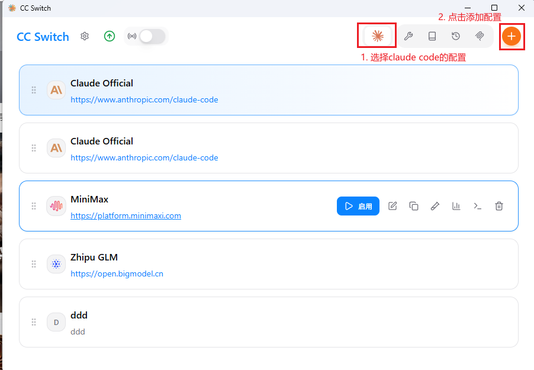
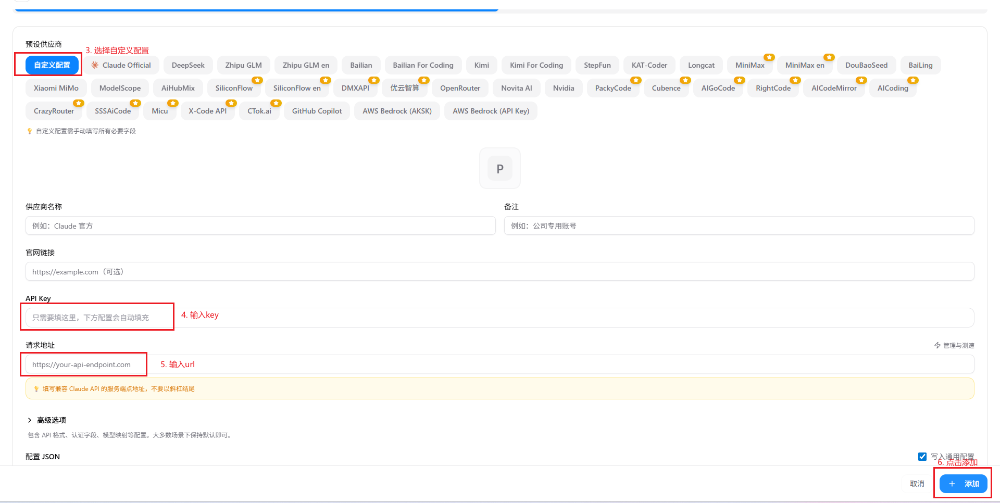
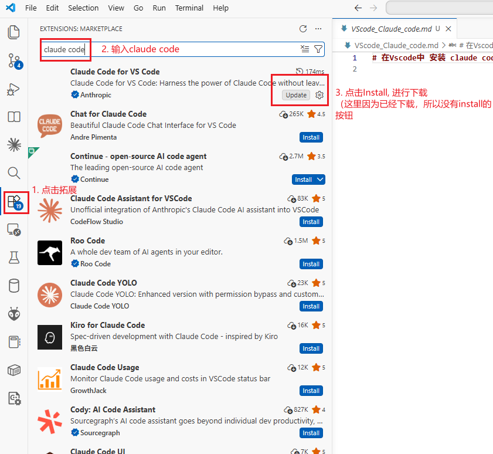
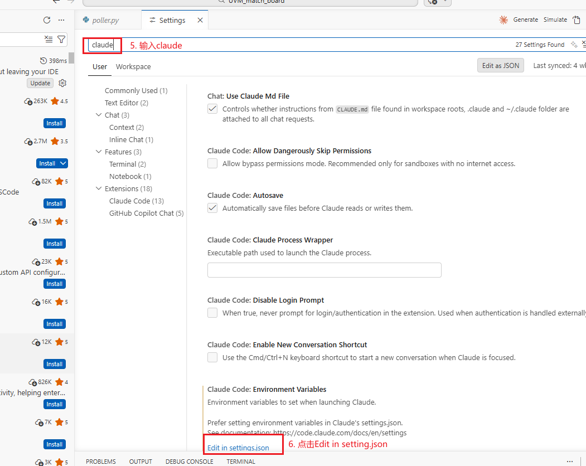

# 配置claude code

## 1. Install_claude
1. 打开PowerShell
`powershell -ExecutionPolicy Bypass -File .\install_claude.ps1`
## 2. 安装CC Switch
1. 点击这个项目中CC-Switch-v3.13.0-Windows.msi，进行安装
2. 安装成功进入CC Switch后，添加配置

3. 添加配置
## 3. 在Vscode中 安装 claude code 插件


输入图片中的内容

```
"claudeCode.environmentVariables": [
        {
            "name": "ANTHROPIC_BASE_URL",
            "value": "URL"
        },
        {
            "name": "ANTHROPIC_AUTH_TOKEN",
            "value": "TOKEN
        }
]
```
**VScode中 的claude code 输入的url和token 和CC switch中输入的url 和Key 是一致的**